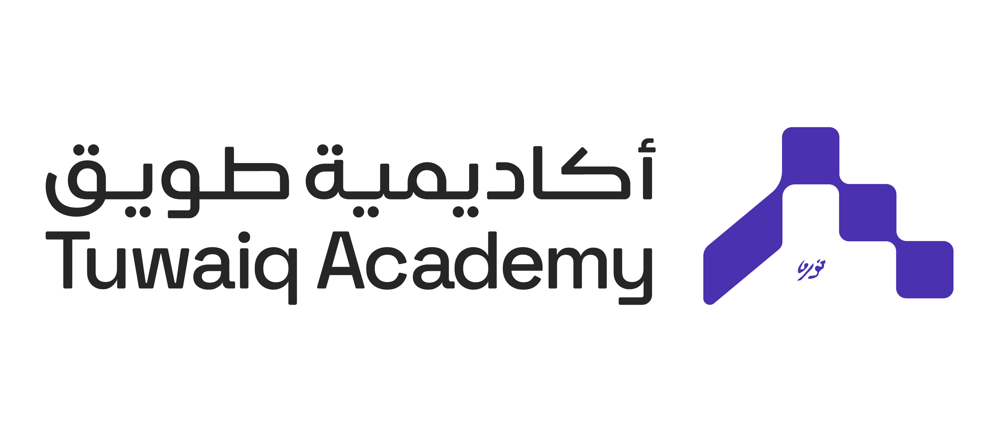

# SDAIA Bootcamp on Congestion Management and Data Analytics

  
  

## Overview
This repository contains all the materials and insights gained from the **SDAIA Bootcamp** focused on **Congestion Management Technologies** and **Data Analytics**. Throughout the bootcamp, I gained hands-on experience and theoretical knowledge in areas crucial for modern traffic management, with a focus on data-driven approaches.

## What I Learned

### 1. **Congestion Management Techniques**
- **Real-Time Traffic Monitoring**: Explored different technologies used to track traffic conditions in real-time, including **IoT sensors**, **camera-based systems**, and **AI-driven traffic analysis**.
- **AI for Traffic Optimization**: Implemented **machine learning models** that predict congestion patterns based on historical data.
- **Predictive Models**: Gained insights into using **time series analysis** and **deep learning models** (e.g., LSTM, RNN) to predict traffic flow.
  
### 2. **Data Analytics in Traffic Management**
- **Data Collection Methods**: Learned how traffic data is gathered from various sources like cameras, GPS systems, and crowd-sourced data.
- **Data Preprocessing**: Techniques for cleaning and preparing large datasets for analysis, including **handling missing data**, **scaling**, and **feature engineering**.
- **Visualization**: Used tools like **Tableau** and **Matplotlib** to visualize traffic data trends, congestion heatmaps, and prediction outcomes.

### 3. **Tools and Technologies**
- **Programming**: Python, Jupyter Notebooks, Pandas, NumPy, Matplotlib.
- **Machine Learning Libraries**: scikit-learn, TensorFlow, Keras.
- **Visualization Tools**: Tableau, Power BI.
- **Data Handling**: SQL, NoSQL databases for storing and retrieving traffic data efficiently.

### 4. **Capstone Project**
- **Traffic Congestion Analysis and Prediction System**: Developed a system to analyze traffic patterns and predict congestion during major events using computer vision and machine learning algorithms.

## Next Steps
- Apply the knowledge from this bootcamp to real-world projects, such as my capstone project **Baseer**, which leverages AI for traffic analysis during large events in Saudi Arabia.
- Continue exploring advanced models for traffic prediction and real-time analysis.

## Contact
Feel free to reach out for collaboration or questions:

**Reem Abdullah Albalawi**  
[LinkedIn](https://www.linkedin.com/in/reem-albalawii/)

---

  

