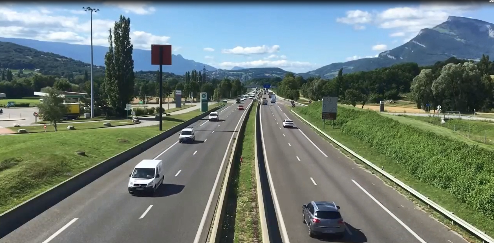
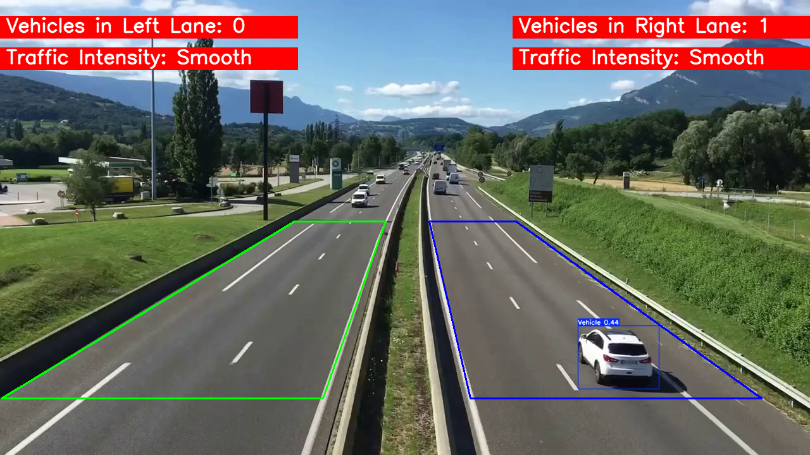

# Real-Time Traffic Estimation Using YOLOv8

  
  

### Authors: 
- Reem Abdullah Albalawi
- Shouq Al-zeer
- Areej Alosaimi
- Alhanouf Alhumid

## Introduction
This project uses **YOLOv8** (You Only Look Once, version 8) for real-time object detection to estimate traffic conditions by analyzing vehicles in traffic videos. The main goal of the project is to detect vehicles, classify them (cars vs. trucks), and estimate the traffic density on road lanes. The analysis is done in real-time, making it suitable for applications in smart cities and live traffic monitoring.

## Objective of the Project
The primary objective of this project is to utilize YOLOv8 for real-time video analysis to:
- Detect vehicles in video footage.
- Classify vehicles as cars or trucks.
- Count the number of vehicles in different lanes (right and left lanes).
- Estimate traffic density based on vehicle count.

## Main Components of the Project
### Data Used:
- **Input Video**: A traffic video used for detecting vehicles and estimating traffic.
- **Model Used**: 
  - **YOLOv8**: A pre-trained deep learning model optimized for real-time vehicle detection.

### Features:
- **Vehicle Classification**: Detects and classifies vehicles as either cars or trucks.
- **Real-Time Vehicle Detection and Counting**: Detects vehicles in real-time, providing a total vehicle count for both right and left lanes.

## Video Demo
You can watch the video result of our real-time traffic estimation using YOLOv8 [here](https://youtu.be/o4J7fSjQF7g).

## Project Overview

### 1. Video Processing Overview
We process the input video using YOLOv8 to detect vehicles and estimate traffic density.

### 2. Real-Time Vehicle Count
The system provides real-time counts of vehicles for both the right and left lanes.

### 3. Vehicle Classification
Vehicles are classified into two categories:
- **Cars**
- **Trucks**

### Visual Results:
#### Vehicle Detection and Counting by Lane:

#### Traffic Density Estimation:

## Conclusion
This project provides a real-time system to estimate traffic density and classify vehicles using YOLOv8. It has potential applications in smart traffic management systems and urban planning, especially for reducing traffic congestion during peak hours.

---

## Thank You!
